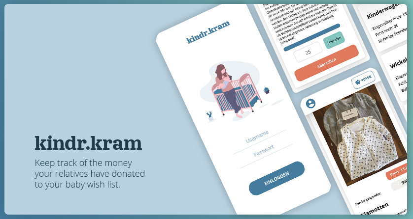

# kindr.kram

kindr.kram helps you keeping track of the money your relatives have donated to your baby wish list.

## About

My wife and I expecting our first child. Since we announced the pregnancy our parents are going crazy and want give us money for buying all the expensive stuff for her first grandchild :-). I recently switch careers and become a web dev and always looking for new app ideas I can code, decided to build a app, where our parents and grandparents can donate money to the "stuff" we want to buy. I really like the idea to keep them involved in the process than just simple give money away.
I loved discussing with my wife about features and how much she was commited to the project. ❤

This project can easily be converted in some sort of "support" app. Just add a wish or a product and let your friends or family donate to the items. Maybe change the logo at the login page ;-)

I learned a lot at building the app. Authentication took much longer than expected and stills feels a bit hacky implementend ;-) I looked into `passport.js` but decided to go with a self implemented jwt approach.

On the way I learned a lot about React `Context` and currently I'm looking into `redux` to get a better feeling, when to use which tool.
## Features

- User/Admin Accounts
- User profil page with donation tracker
- Small admin dashboard
- Admin can create/update items in database through frontend
- Picture upload to cloudinary
- sort function before rendering Itemlist:
  - fully donated items at the end
  - smalles amount to donate first
- Donation progress bar

## Build with

- React
- Express.js
- MongoDB & mongoose
- jwt auth
- styled-components
- Cloudinary
- deployed on AWS

# Getting Started

## Prerequisites

In order to run the app you need on your local machine you need

- a Mongo DB (local or in the cloud doesn't matter)
- a free cloudinary account (for picture upload)

## Installation

- clone the project
- `cd` in the root directory and hit `npm install`
- you nee
